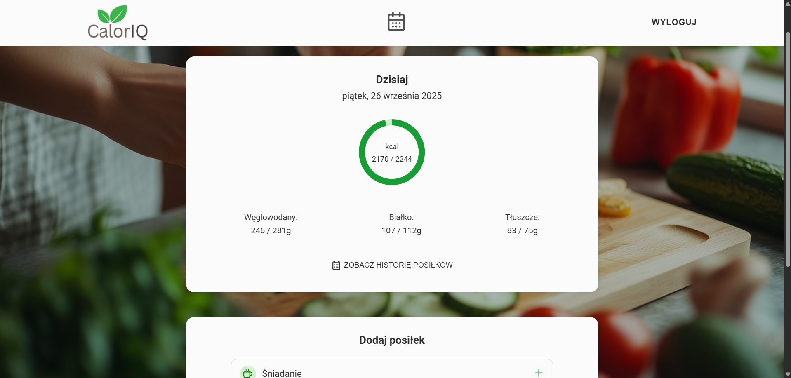
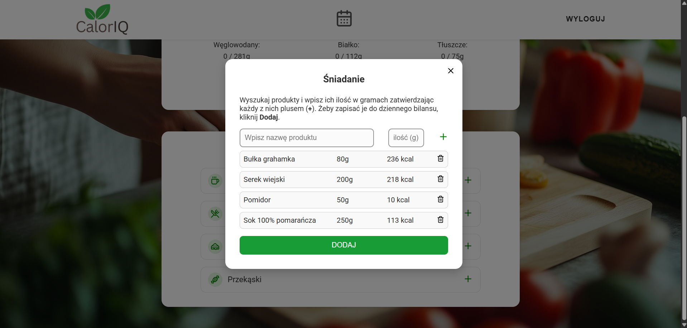
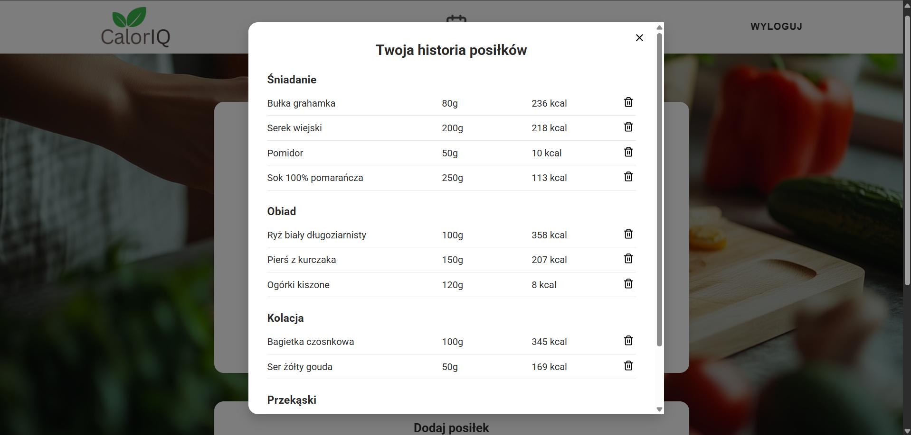

# CalorIQ

**CalorIQ** is a dietary application designed to help users calculate their daily caloric needs, track food intake and maintain healthy eating habits based on personalized goals such as weight loss, gain or maintenance.

Created as a **portfolio project** to practice React, Firebase, and API integration.

**Live Demo:** [View CalorIQ](https://caloriq.netlify.app)

## ✨ Features

- **User Authentication** – registration and login system using Firebase Auth

- **Form Validation** – validation with react-hook-form and zod for clean user input handling

- **Calorie Calculator** – users input age, weight, height, gender and activity level to get a personalized daily calorie goal

- **Product Search** – integrated with the OpenFoodFacts API to search for food items and fetch nutritional data

- **Meal Tracker** – log food by selecting products and entering portion sizes with automatic calorie and macronutrient calculation

- **Calendar** – view and track past entries by date

- **Persistent Data** – meals and calorie entries are stored in Firebase Firestore and cached locally using Zustand

## 🛠️ Technologies Used

- **React** – frontend UI framework

- **React Router DOM** – routing and navigation

- **SCSS Modules** – modular, scoped and responsive styling

- **React Hook Form + Zod** – form handling and schema validation

- **Zustand** – global state management

- **OpenFoodFacts API** – for retrieving product nutritional data

- **Firebase** – user authentication and Firestore database

## 📸 Screenshots

### User Main Page



### Add Products Panel



### Meal History Panel



## 🚀 Installation & Setup

```bash
git clone https://github.com/angelika-musial/diet-app.git
cd diet-app
npm install
npm run dev
```

## License

This project was created for educational and portfolio purposes only.
